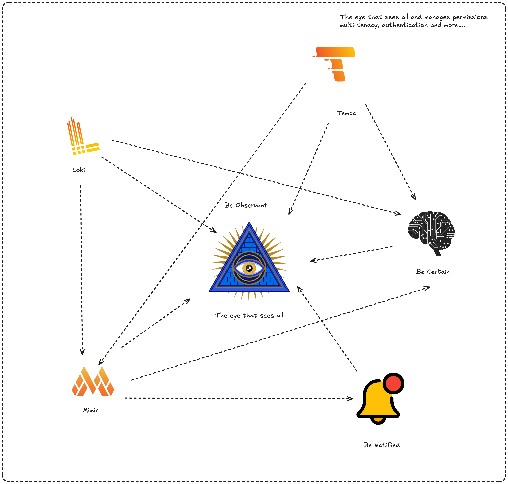

# Be Observant

A unified observability platform — metrics, logs, traces, and alerts in one place. Created to watch and conquer them all



Built on **Grafana**, **Loki**, **Tempo**, **Mimir**, and **Alertmanager**, Be Observant is designed for production use as an observability control plane, aiming for enterprise-grade security, multi-tenancy, and a clean REST API.


Built on **Grafana**, **Loki**, **Tempo**, **Mimir**, and **Alertmanager**, Be Observant is designed for production use as an observability control plane, aiming for enterprise-grade security, multi-tenancy, and a clean REST API.

## Distributed Tracing

With Tempo as the backbone, Be Observant Proxies and scopes Traces based on the API key to enforce multi-tenacy


With visualization of spans and multiple traces using React flow


## Logs

With Loki as the backbone, Be Observant Proxies and scopes Logs based on the API key to enforce multi-tenacy


## Alerting 

With Be Notified as the backbone, Be Observant Proxies and scopes Logs based on the API key to enforce multi-tenacy, visit https://github.com/StefanKumarasinghe/benotified


# InOps

With Be Notified as the backbone, Be Observant Proxies and scopes Logs based on the API key to enforce multi-tenacy, visit https://github.com/StefanKumarasinghe/benotified


# Grafana for Visualization

With Grafana as the backbone, Be Observant Proxies and scopes Logs based on the API key and permissions by proxing the request via an nginx proxy


The proxy powered by nginx to limit specific routes the admin allows and scoping to the visibility the user has


---

## Architecture

| Component | Role | Port |
|---|---|---|
| `beobservant` | Core REST API (FastAPI) | `4319` |
| `benotified` | Internal alerting/incident service | `4323` |
| `gateway-auth` | OTLP token validation service | internal |
| `grafana-proxy` | Authenticated Grafana reverse proxy | `8080` |
| `otlp-gateway` | Envoy-based OTLP ingestion gateway | `4320` |
| `otel-agent` | OpenTelemetry collector | `4317` / `4318` |
| `loki` | Log storage and querying | internal |
| `tempo` | Distributed trace storage | internal |
| `mimir` | Long-term metrics storage | internal |
| `alertmanager` | Alert routing and silences | internal |
| `postgres` | Primary database | internal |
| `redis` | Rate limiting and caching | internal |

---

## Quick Start

### 1. Configure environment

```bash
cp .env.example .env
```

Edit `.env` and set the required variables:

Generate a Fernet key for `DATA_ENCRYPTION_KEY`:

```bash
python -c "from cryptography.fernet import Fernet; print(Fernet.generate_key().decode())"
```

use that key to update the DATA_ENCRYPTION_KEY

### 2. Start the stack

```bash
docker compose up -d --build
```

### 3. Verify

```bash
curl -s http://localhost:4319/health
```

### 4. Access

| Interface | URL |
|---|---|
| UI | http://localhost:5173 |
| API Docs | http://localhost:4319/docs |
| Grafana | http://localhost:8080/grafana/ |

---

## Local Development

```bash
docker compose up --build -d
```

Your ui should be running at localhost:5173 unless it is not freed, also ensure if you enable CORS, to add `localhost:5173` to the environment page

To get access to Be Notified and Be Certain you must use these links https://github.com/StefanKumarasinghe/becertain/ and https://github.com/StefanKumarasinghe/benotifed and set it up in the repo and adjust the file names

Be Notified runs as an internal service and should not be exposed publicly. Main server proxies `/api/alertmanager/*` while preserving permission/scope checks and main audit semantics.

---

## OTLP Ingestion


Send telemetry to the gateway on port `4320`. Include your token in every request, this will be generated on your ui


```
x-otlp-token: <your-token>
```

The gateway validates the token and maps the request to the correct tenant and organisation. Historically the gateway queried Postgres directly, but the current implementation is completely **database‑free**; it uses Redis for caching and/or rate limiting and an HTTP call to the main server for token resolution. This simplifies deployment and allows the gateway to run in environments where database access is restricted. See `GATEWAY_AUTH_API_URL`, `RATE_LIMIT_REDIS_URL`, and `TOKEN_CACHE_REDIS_URL` for configuration. To enforce a Redis-only rate limiter (no in-memory fallback) set `GATEWAY_RATE_LIMIT_STRICT=true`. The OTLP token is your API key — configure it on the collector side and never share it publicly. It maps internally to an `X-Org-Scope-ID` that scopes all data access within the multi-tenant ecosystem.

---

## Authentication

**Local (default)** — bcrypt password + JWT (RS256 / ES256) with MFA/TOTP. The default admin account requires MFA to be configured on first login.

**OIDC / Keycloak** — set `AUTH_PROVIDER=keycloak` and configure:

```env
OIDC_ISSUER_URL=
OIDC_CLIENT_ID=
OIDC_CLIENT_SECRET=
AUTH_PASSWORD_FLOW_ENABLED=false
```

OIDC endpoints: `POST /api/auth/oidc/authorize-url`, `POST /api/auth/oidc/exchange`, `GET /api/auth/mode`

---

## Security Highlights

- Asymmetric JWT signing (RS256 / ES256) — keys validated at startup
- MFA/TOTP with encrypted secret storage
- Role-based access control with fine-grained Grafana proxy RBAC
- Immutable audit logs enforced by a Postgres DB trigger
- Per-user and per-IP rate limiting with Redis backend and in-memory fallback
- IP allowlists for all sensitive public endpoints
- Request payload size limits and concurrency backpressure middleware
- Multi-tenant isolation: tenant and org scoping on all resources and API keys
- Vault compatibility: If you don't want to load using env keys you can configure a VAULT ROLE to fetch sensitive data from there

> **Secrets:** Sensitive values (DB URL, JWT keys, SMTP passwords, API keys) can be provided via environment variables or fetched from a secrets backend. Set `VAULT_ENABLED=true` and provide `VAULT_ADDR`/AppRole or token to load secrets from HashiCorp Vault. See `USER_GUIDE.md` → "Secret management / Vault" for details.

---

## Testing & Load Generation

A default OTel agent and canary log/trace generators are included and run automatically with the stack, you may comment that out if you dont want it. You can tweak the generator at `tests/start.sh`

---

## Teardown

```bash
docker compose down       # stop services, keep volumes
docker compose down -v    # stop services and remove all volumes (including user data)
# bash fresh.sh will create a fresh DB and erase all volumes
```

---

## Production Checklist

- [ ] Set `JWT_AUTO_GENERATE_KEYS=false` and provide explicit PEM keys
- [ ] Set `DEFAULT_ADMIN_BOOTSTRAP_ENABLED=false` and provision admin via automation
- [ ] Configure `DATA_ENCRYPTION_KEY` for MFA/TOTP secret encryption
- [ ] Set `REQUIRE_TOTP_ENCRYPTION_KEY=true`
- [ ] Configure IP allowlists: `WEBHOOK_IP_ALLOWLIST`, `GATEWAY_IP_ALLOWLIST`, `AUTH_PUBLIC_IP_ALLOWLIST`, `GRAFANA_PROXY_IP_ALLOWLIST`
- [ ] Set `REQUIRE_CLIENT_IP_FOR_PUBLIC_ENDPOINTS=true`
- [ ] Set `TRUST_PROXY_HEADERS=false` unless behind a verified reverse proxy
- [ ] Configure Redis for rate limiting: `RATE_LIMIT_BACKEND=redis`
- [ ] Terminate TLS at your load balancer or edge proxy
- [ ] Set `DB_AUTO_CREATE_SCHEMA=false` after initial migration
- [ ] Rotate all default credentials immediately

---

## Documentation

Full user and administrator guidance is in [`USER_GUIDE.md`](./USER_GUIDE.md).

Service-specific notes for the internal alerting engine are in [`BeNotified/README.md`](./BeNotified/README.md).
