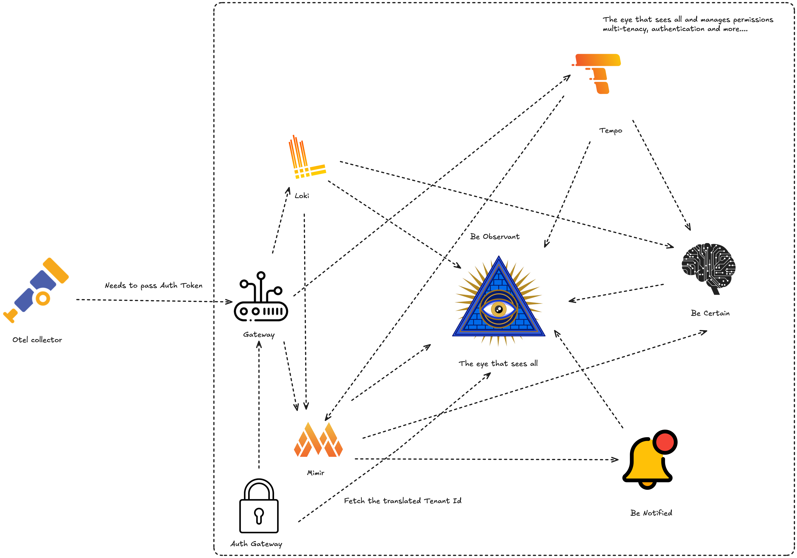

# Be Observant

Unified observability platform for metrics, logs, traces, and alerts in one control plane.

Built on **Grafana**, **Loki**, **Tempo**, **Mimir**, **Alertmanager**, and internal services for auth and alerting.

## Distributed Tracing

Tempo-backed tracing with tenant/org scoping enforced through API token context.


## Logs

Loki-backed log search and analytics with scoped access controls.


## Alerting and Incident Ops

- BeNotified repo: [github.com/observantio/benotified](https://github.com/observantio/benotified)

## Grafana Visualization

Grafana access is proxied through an authenticated NGINX layer with RBAC and visibility scoping.

---

## Architecture

| Component | Role | Port |
|---|---|---|
| `beobservant` | Core REST API (FastAPI) | `4319` |
| `benotified` | Internal alerting/incident service | `4323` |
| `becertain` | Internal RCA analytics engine | internal |
| `gateway-auth` | OTLP token validation service | internal |
| `grafana-proxy` | Authenticated Grafana reverse proxy | `8080` |
| `otlp-gateway` | Envoy-based OTLP ingestion gateway | `4320` |
| `otel-agent` | OpenTelemetry collector | `4317` / `4318` |
| `loki` | Log storage/query | internal |
| `tempo` | Trace storage/query | internal |
| `mimir` | Metrics storage/query | internal |
| `alertmanager` | Alert routing/silences | internal |
| `postgres` | Primary database | internal |
| `redis` | Rate limiting/cache | internal |

---

## Quick Start

### 1. Configure environment

```bash
cp .env.example .env
```

Generate a Fernet key for `DATA_ENCRYPTION_KEY`:

```bash
python -c "from cryptography.fernet import Fernet; print(Fernet.generate_key().decode())"
```

Set that value in `.env`.

### 2. Choose a run mode

Option A: source-build mode (full local development)

- Requires these sibling directories:
  - `./BeCertain`
  - `./BeNotified`
- If missing, clone them first:

```bash
git clone https://github.com/observantio/becertain BeCertain
git clone https://github.com/observantio/benotified BeNotified
```

Then start:

```bash
docker compose up -d --build
```

Option B: image mode (no local BeCertain/BeNotified checkout)

- Set image tags in `.env`:
  - `BEOBSERVANT_IMAGE`
  - `BENOTIFIED_IMAGE`
  - `BECERTAIN_IMAGE`
- Then start:

```bash
docker compose -f docker-compose.stable.yml up -d
```

The provided defaults are placeholders until you publish stable tags.

### 3. Verify health

```bash
curl -s http://localhost:4319/health
```

### 4. Access interfaces

| Interface | URL |
|---|---|
| UI | [http://localhost:5173](http://localhost:5173) |
| API Docs | [http://localhost:4319/docs](http://localhost:4319/docs) |
| Grafana | [http://localhost:8080/grafana/](http://localhost:8080/grafana/) |

---

## Local Development

Source-build compose (`docker-compose.yml`) expects local copies of `BeCertain` and `BeNotified`.

```bash
docker compose up -d --build
```

- UI runs on `localhost:5173` by default.
- If CORS is enabled, include `http://localhost:5173` in allowed origins.
- BeNotified runs as an internal service and should not be exposed publicly.
- BeCertain runs as an internal service and should not be exposed publicly.
- Public alert APIs remain under `/api/alertmanager/*` on Be Observant.
- RCA APIs are exposed through Be Observant under `/api/becertain/*`.

Related repos:

- BeCertain: [github.com/observantio/becertain](https://github.com/observantio/becertain)
- BeNotified: [github.com/observantio/benotified](https://github.com/observantio/benotified)

---

## Pre-commit Checks

The repository includes a required pre-commit pipeline in `.pre-commit-config.yaml` that runs on every commit:

- `server`: `python -m pytest -q`
- `BeCertain`: `python -m pytest -q`
- `BeNotified`: `python -m pytest -q`
- `gateway-auth-service`: `python -m pytest -q`
- `ui`: `npm run lint`
- `ui`: `npm run test:run`
- `ui`: `npm run build`

Install and enable:

```bash
pip install pre-commit
pre-commit install
```

Run manually at any time:

```bash
pre-commit run --all-files
```

---

## OTLP Ingestion

Send telemetry to gateway port `4320` and include:

```http
x-otlp-token: <your-token>
```



Gateway behavior:

- Validates token and resolves tenant/org scope
- Uses Redis for cache/rate-limit behavior
- Resolves token context via HTTP to the main server (no direct DB dependency in gateway)

Key settings:

- `GATEWAY_AUTH_API_URL`
- `RATE_LIMIT_REDIS_URL`
- `TOKEN_CACHE_REDIS_URL`
- `GATEWAY_RATE_LIMIT_STRICT=true` for Redis-only limiter mode

---

## Authentication

Local mode (default):

- bcrypt password auth
- JWT (RS256/ES256)
- MFA/TOTP (admin setup required on first login)

OIDC/Keycloak mode:

```env
AUTH_PROVIDER=keycloak
OIDC_ISSUER_URL=
OIDC_CLIENT_ID=
OIDC_CLIENT_SECRET=
AUTH_PASSWORD_FLOW_ENABLED=false
```

OIDC endpoints:

- `POST /api/auth/oidc/authorize-url`
- `POST /api/auth/oidc/exchange`
- `GET /api/auth/mode`

---

## RCA Console (BeCertain via Be Observant)

- UI route: `/rca`
- Be Observant proxy base: `/api/becertain`
- Slow full analysis uses async jobs:
  - `POST /api/becertain/analyze/jobs`
  - `GET /api/becertain/analyze/jobs`
  - `GET /api/becertain/analyze/jobs/{job_id}`
  - `GET /api/becertain/analyze/jobs/{job_id}/result`
- Fast read APIs are also proxied through `/api/becertain/*` (correlation, topology, causal, forecast, SLO, anomalies, ML weights, deployments).

Required environment settings (shared across Be Observant + BeCertain):

- `BECERTAIN_URL=http://becertain:4322`
- `BECERTAIN_SERVICE_TOKEN`
- `BECERTAIN_EXPECTED_SERVICE_TOKEN`
- `BECERTAIN_CONTEXT_SIGNING_KEY`
- `BECERTAIN_CONTEXT_VERIFY_KEY`
- `BECERTAIN_CONTEXT_ISSUER=beobservant-main`
- `BECERTAIN_CONTEXT_AUDIENCE=becertain`
- `BECERTAIN_CONTEXT_ALGORITHM=HS256`
- `BECERTAIN_CONTEXT_ALGORITHMS=HS256`
- `BECERTAIN_TLS_ENABLED=false` (proxy outbound TLS verification)
- `BECERTAIN_SSL_ENABLED=false` (optional inbound TLS on BeCertain server)
- `BECERTAIN_ANALYZE_STORAGE_PATH=./data/becertain_jobs` (disk cache for job metadata + reports)
- `BECERTAIN_ANALYZE_JOB_TTL_SECONDS=3600` (metadata retention)
- `BECERTAIN_ANALYZE_REPORT_RETENTION_DAYS=7` (persisted report retention)

---

## Security Highlights

- Asymmetric JWT signing (RS256/ES256)
- MFA/TOTP with encrypted secret storage
- RBAC with scoped Grafana proxy access
- Immutable audit logs (DB trigger enforcement)
- Per-user/per-IP rate limiting (Redis + fallback modes)
- IP allowlists for sensitive endpoints
- Request size limits and concurrency backpressure
- Tenant/org isolation across APIs and API keys
- Internal BeCertain authentication using service token + signed context JWT
- Vault-based secret loading support

> Secrets (DB URL, keys, passwords, API keys) can be provided via env vars or Vault.  
> Set `VAULT_ENABLED=true` and configure `VAULT_ADDR` with AppRole or token auth.  
> See [`USER_GUIDE.md`](./USER_GUIDE.md) for details.

---

## Testing and Load Generation

The default stack includes an OTel agent and canary log/trace generators.  
You can tune or disable generator behavior in `tests/start.sh`.

---

## Teardown

```bash
docker compose down       # stop services, keep volumes
docker compose down -v    # stop services and remove volumes
# bash fresh.sh           # recreate from a fresh state
```

---

## Production Checklist

- [ ] Set `JWT_AUTO_GENERATE_KEYS=false` and provide explicit PEM keys
- [ ] Set `DEFAULT_ADMIN_BOOTSTRAP_ENABLED=false`
- [ ] Configure `DATA_ENCRYPTION_KEY` for MFA/TOTP secret encryption
- [ ] Set `REQUIRE_TOTP_ENCRYPTION_KEY=true`
- [ ] Configure IP allowlists: `WEBHOOK_IP_ALLOWLIST`, `GATEWAY_IP_ALLOWLIST`, `AUTH_PUBLIC_IP_ALLOWLIST`, `GRAFANA_PROXY_IP_ALLOWLIST`
- [ ] Set `REQUIRE_CLIENT_IP_FOR_PUBLIC_ENDPOINTS=true`
- [ ] Set `TRUST_PROXY_HEADERS=false` unless behind a trusted reverse proxy
- [ ] Configure Redis rate limiting: `RATE_LIMIT_BACKEND=redis`
- [ ] Terminate TLS at edge/load balancer
- [ ] Set `DB_AUTO_CREATE_SCHEMA=false` after initial migration
- [ ] Configure BeCertain trust chain: `BECERTAIN_SERVICE_TOKEN`, `BECERTAIN_EXPECTED_SERVICE_TOKEN`, `BECERTAIN_CONTEXT_SIGNING_KEY`, `BECERTAIN_CONTEXT_VERIFY_KEY`
- [ ] Keep BeCertain internal-only (no public host port)
- [ ] Rotate all default credentials

---

## Documentation

- Main guide: [`USER_GUIDE.md`](./USER_GUIDE.md)
- BeNotified service notes: [`BeNotified/README.md`](./BeNotified/README.md)
- Notices and attribution: [`NOTICE.md`](./NOTICE.md)
